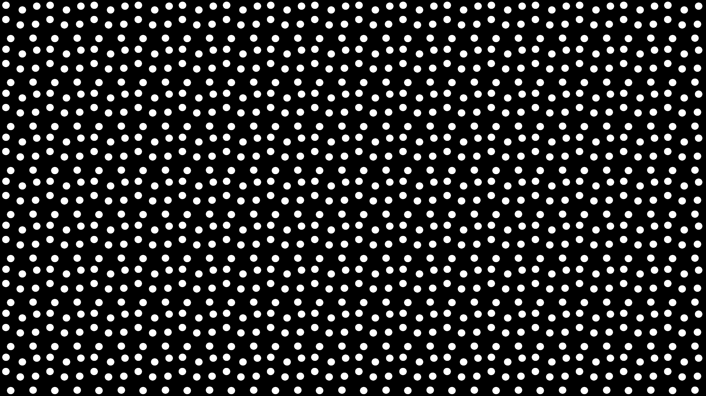

# Python-Rapid-Circle-Detection
## Overview
Get info on colour-contrasted circular objects in an image within seconds, using OpenCV library. The original application was for counting fibers in optical fiber bundles, so the algorithm is best able to detect and count light circles with a totally dark background and consistent radius.

Inspired by this StackOverflow post: https://stackoverflow.com/questions/26932891/detect-touching-overlapping-circles-ellipses-with-opencv-and-python. 

I have added several different masks and filters to remove circles that are too dark, remove small artifacts, as well as improve the general image processing.

The algorithm completes a circle counting job much faster than the Hough Gradient method, **especially with large circle counts**, as running an accumulator along all the detected edges in an image takes time.

## Setting Up
You'll just need to clone this repo and get the necessary libraries.

Clone this repository with Git:
```
git clone https://github.com/Eric-Ptn/Python-Rapid-Circle-Detection.git
```

Make a virtual environment, activate it, then run
```
pip install -r requirements.txt
```

Now use either of `analyze_photos.py` or `camera_and_analyze_photo.py` to your liking :) 

(with the venv activated if you created one)

## Usage

Starting with a simple image containing many circles:



You will be prompted with a window showing the image, and a window showing the template circle. 

Press any key to exit both windows, then alter the template circle size to match the circles in the image via the prompt in the command line. Enter `0` once done sizing to continue.

After about a second, you'll get this result, which will also be copied to your clipboard:


The program can do almost ok for overlapping circles, but it's not perfect:


If you have a complicated background or varying circle sizes and need high accuracy, it would probably be best to use a machine learning approach (like segmentanything).

Hopefully someone finds this useful :) Open to any suggestions or improvements.